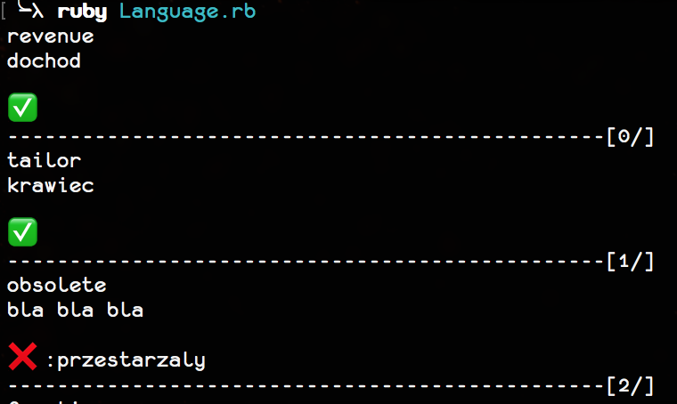

# Language
Because for english learning purposes most of the times I create .xlsx file with words to learn, I have created for myself small script for training words randomly fetched from .xlsx file. 📖

## TODO
- [x] fix crash related with 'nil' occurrence in 'sheet'
- [] code cleanup (e.g. add access modifiers for methods)
- [] display number of answered correctly and incorrectly words
- [] store wrong answers in separate file, in that way we will extract words on which we need to focus :)
- [] add 'larn' mode in which words will be shown randomly with related meaninng
